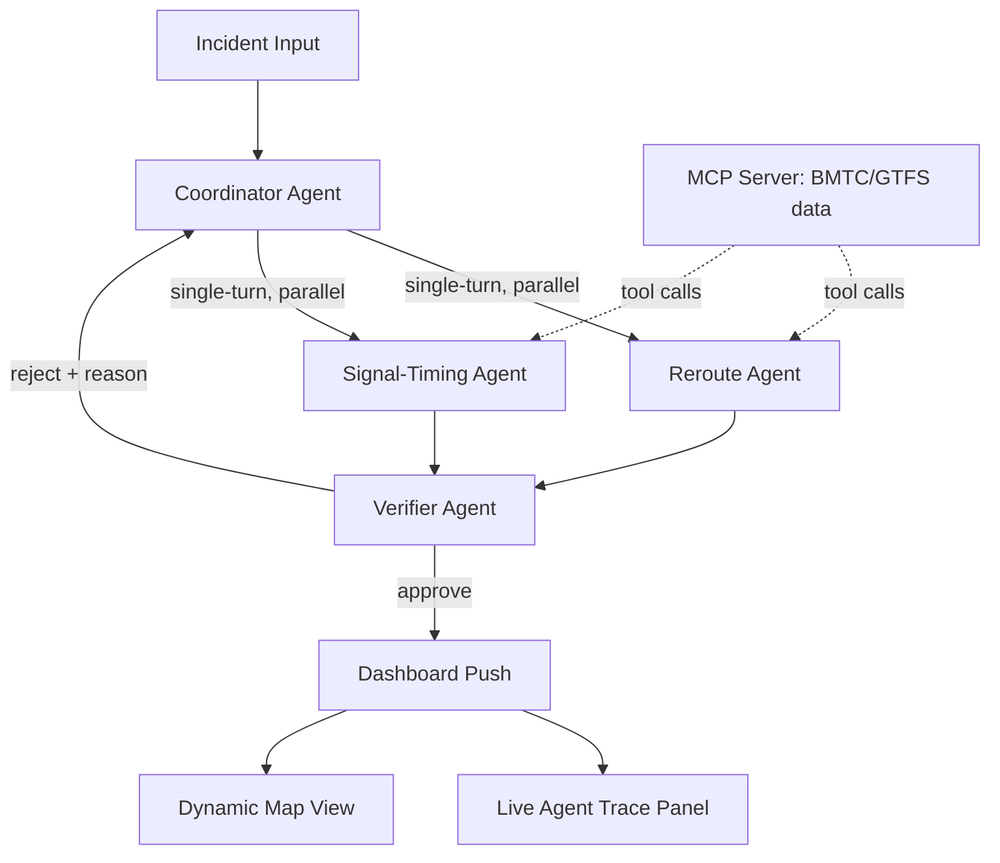

# SIGNAL
### Self-correcting multi-agent traffic response system for Bengaluru

Built for **Google AI Agent Builder Series 2026** — Traffic Management track.

---

## Problem Statement

When an incident hits Bengaluru traffic — an accident, waterlogging, a VIP movement, a signal failure — there is no system that replans signal timing, reroutes, and public alerts *together*, in real time, while checking whether its own plan creates a **new** bottleneck before pushing it live.

Existing tools show you traffic. None of them replan and *verify their own replan*. That verification step is the gap SIGNAL closes.

## What SIGNAL Actually Does

Given a live incident, SIGNAL:
1. Identifies the affected zone and severity.
2. Proposes a reroute plan and a signal-timing adjustment for junctions in the blast radius.
3. **Verifies the proposed plan against a second-order check** — does fixing this bottleneck create a new one nearby?
4. If verification fails, rejects the plan with a reason and forces the coordinator to retry with that constraint.
5. Only then pushes the final, approved plan to the dashboard.

The retry loop is the core differentiator. Most agent demos are single-shot LLM calls wearing a UI. SIGNAL is a graph of agents that can catch and correct its own mistakes autonomously.

## Key Features & Polish (Demo Ready)

- **Dynamic Interactive Map:** Powered by Leaflet, the map dynamically renders incident locations, impact zones, blocked routes, and affected junctions. The final approved reroute animates onto the map only *after* the Verifier agent approves it.
- **Live Agent Trace Panel:** A glassmorphic command center UI that streams the internal thought process of the multi-agent system.
- **Bulletproof Execution (`ReliableLlm`):** We wrapped the LLM calls so that if the API rate-limits or fails during a live judging demo, the system instantly falls back to a simulated mock response. The demo never crashes.
- **Cost-Controlled Intelligence:** All agents run on **Gemini 2.5 Flash** routed through **OpenRouter** (via `LiteLlm`) for aggressive cost management without sacrificing reasoning capability.
- **Scenario Picker:** 6 distinct, hyper-local Bengaluru incident scenarios (e.g., Waterlogging at Koramangala, VIP movement at Vidhana Soudha, pile-up on Hebbal Flyover) ready to trigger at the click of a button.

## Architecture



### Agents

| Agent | Role | Model | Mode |
|---|---|---|---|
| Coordinator | Receives incident, delegates, owns retry loop | Gemini 2.5 Flash (OpenRouter) | orchestrator |
| Reroute Agent | Computes affected routes and alternates | Gemini 2.5 Flash (OpenRouter) | single-turn (agent-as-tool) |
| Signal-Timing Agent | Proposes green-light changes for junctions in radius | Gemini 2.5 Flash (OpenRouter) | single-turn (agent-as-tool) |
| Verifier Agent | Checks proposed plan for bottlenecks; approves/rejects | Gemini 2.5 Flash (OpenRouter) | single-turn, called by coordinator |

Built on **ADK 2.0** Workflow runtime (graph-based execution) + Collaborative Workflows API for delegation.

### MCP Server & Backend API

- **Backend API (`api/main.py`)**: A FastAPI server that handles the WebSocket connection for the live agent trace (`/ws/logs`) and the incident trigger endpoint (`/api/incident`).
- **MCP Server (`mcp_server/main.py`)**: Exposes traffic data as tools to the agents over Stdio.
  - `get_gtfs_routes(zone)` — BMTC GTFS feed lookup
  - `get_junction_signal_state(junction_id)`
  - `inject_incident(location, type, severity)` — synthetic incident generator for the demo.

## Tech Stack

- **Agents:** `google/adk-python` 2.0 (Workflow + Task API), `LiteLlm` + OpenRouter (Gemini 2.5 Flash)
- **Tool layer:** MCP server, FastAPI
- **Data:** BMTC GTFS feed (real) + synthetic incident generator (simulated)
- **Frontend:** Next.js, Leaflet (OpenStreetMap tiles), WebSocket for live agent trace
- **Deploy:** Render / Vercel

## Repo Structure

```text
signal/
├── agents/
│   ├── coordinator/
│   ├── reroute_agent/
│   ├── signal_timing_agent/
│   ├── verifier/
│   └── reliable_llm.py       # Fallback wrapper for bulletproof demos
├── api/
│   └── main.py               # FastAPI backend (WebSocket trace, Trigger endpoint)
├── mcp_server/
│   ├── main.py               # Stdio MCP server for data tools
│   ├── tools/
│   └── data/                 # cached GTFS snapshot
├── frontend/
│   ├── src/app/              # Next.js app, CSS, Layouts
│   ├── src/components/       # MapView, AgentTracePanel
│   └── package.json
├── demo/
│   └── test_harness.py       # CLI tester for the agent loop
└── README.md
```


