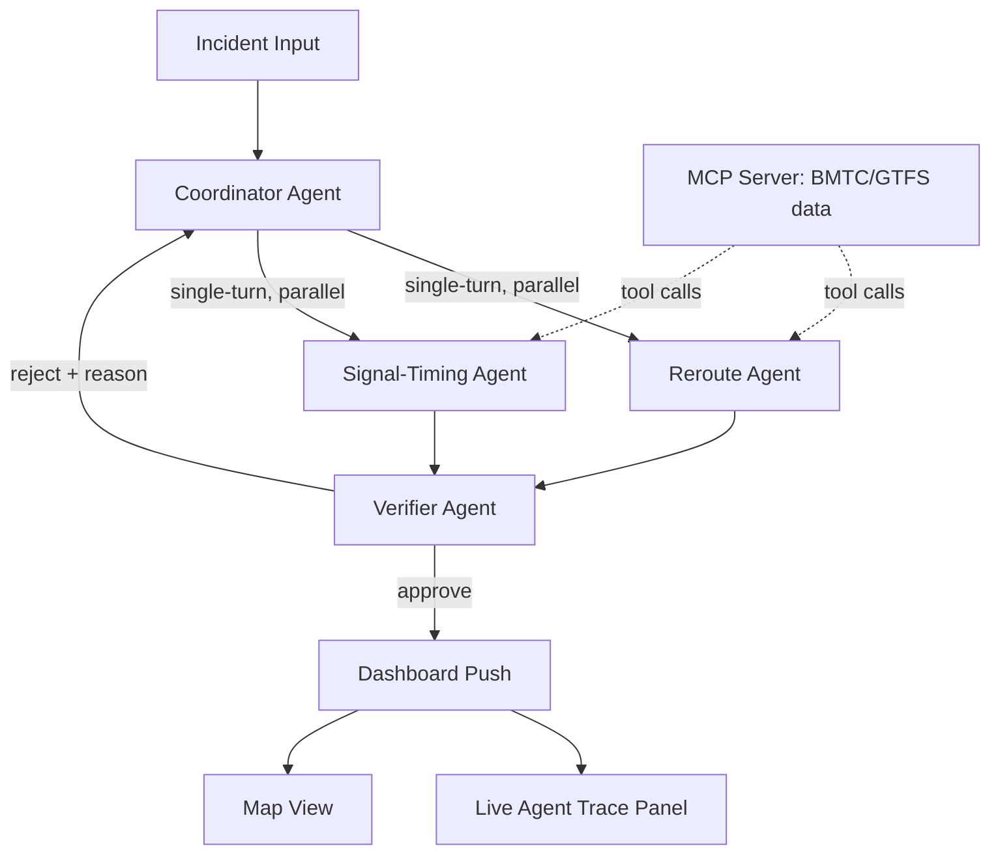

# SIGNAL
### Self-correcting multi-agent traffic response system for Bengaluru

Built for **Google AI Agent Builder Series 2026** — Traffic Management track.

---

## Problem Statement

When an incident hits Bengaluru traffic — an accident, waterlogging, a VIP movement, a signal failure — there is no system that replans signal timing, reroutes, and public alerts *together*, in real time, while checking whether its own plan creates a **new** bottleneck before pushing it live.

Existing tools show you traffic. None of them replan and *verify their own replan*. That verification step is the gap SIGNAL closes.

## What SIGNAL Actually Does

Given a live incident, SIGNAL:
1. Identifies the affected zone and severity
2. Proposes a reroute plan and a signal-timing adjustment for junctions in the blast radius
3. **Verifies the proposed plan against a second-order check** — does fixing this bottleneck create a new one nearby?
4. If verification fails, rejects the plan with a reason and forces the coordinator to retry with that constraint
5. Only then pushes the plan to the dashboard

The retry loop is the core differentiator. Most agent demos are single-shot LLM calls wearing a UI. SIGNAL is a graph of agents that can catch and correct its own mistakes, visibly, in front of the judges.

## Architecture



### Agents

| Agent | Role | Model | Mode |
|---|---|---|---|
| Coordinator | Receives incident, delegates, owns retry loop | Gemini 2.5 Pro | orchestrator |
| Reroute Agent | Computes affected routes and alternates | Gemini 2.5 Flash | single-turn (agent-as-tool) |
| Signal-Timing Agent | Proposes green-light window changes for junctions in radius | Gemini 2.5 Flash | single-turn (agent-as-tool) |
| Verifier Agent | Checks proposed plan for second-order bottlenecks; approves or rejects with reason | Gemini 2.5 Flash | single-turn, called by coordinator |

Built on **ADK 2.0** Workflow runtime (graph-based execution) + Collaborative Workflows API for delegation.

### MCP Server

A FastAPI-based MCP server exposes traffic data as tools rather than hardcoded API glue:
- `get_gtfs_routes(zone)` — BMTC GTFS feed lookup
- `get_junction_signal_state(junction_id)`
- `inject_incident(location, type, severity)` — for the synthetic incident generator used in the demo (no live sensor access in 18 days, so incidents are simulated but agent logic is real)

### Frontend

Next.js dashboard with two panels:
- **Map view** — incident location, proposed reroutes, affected junctions
- **Agent trace panel** — live websocket stream showing every agent call, its output, and any verifier rejection + retry. This panel is what sells the demo, not the map.

## Tech Stack

- **Agents:** `google/adk-python` 2.0 (Workflow + Task API), Gemini 2.5 Pro / Flash
- **Tool layer:** MCP server, FastAPI
- **Data:** BMTC GTFS feed (real) + synthetic incident generator (simulated)
- **Frontend:** Next.js, Leaflet (OpenStreetMap tiles), WebSocket for live agent trace
- **Deploy:** Cloud Run (backend), Vercel (frontend)

## Repo Structure

```
signal/
├── agents/
│   ├── coordinator.py
│   ├── reroute_agent.py
│   ├── signal_timing_agent.py
│   ├── verifier_agent.py
│   └── graph.py              # ADK Workflow graph definition
├── mcp_server/
│   ├── main.py
│   ├── tools/
│   │   ├── gtfs.py
│   │   ├── signals.py
│   │   └── incidents.py
│   └── data/                 # cached GTFS snapshot
├── frontend/
│   ├── app/
│   ├── components/
│   │   ├── MapView.tsx
│   │   └── AgentTracePanel.tsx
│   └── lib/websocket.ts
├── demo/
│   └── incident_script.json  # scripted incident for live demo
└── README.md
```

## Setup

```bash
# Backend
cd mcp_server && pip install -r requirements.txt
cd ../agents && pip install google-adk
adk web ./agents   # local dev UI to inspect agent execution

# Frontend
cd frontend && npm install && npm run dev
```

Environment variables needed: `GEMINI_API_KEY`, `MCP_SERVER_URL`.

## Demo Script (4 minutes)

1. **[0:00–0:30]** Problem framing — one slide, no more
2. **[0:30–1:30]** Inject a real incident live (e.g. accident near Marathahalli ORR) — show coordinator delegating to reroute + signal-timing agents in parallel via the trace panel
3. **[1:30–2:30]** Show verifier catching a second-order bottleneck and rejecting the first plan — this is the moment, let it breathe
4. **[2:30–3:15]** Show corrected plan getting approved and pushed to the map
5. **[3:15–4:00]** Architecture recap + what's next (real sensor integration, multi-city)

## Cut List (explicitly out of scope for 18 days)

- Auth / multi-user
- Multi-city support
- Real sensor hardware integration
- Any UI polish beyond the trace panel and map

If it doesn't appear in the 4-minute demo, it doesn't get built.

## Team

- Nishit Patel — agents, MCP server, backend
- Vanshaj Garg — frontend, dashboard, deploy
- Jaineesh Patel — MCP server, data, deploy

## Roadmap (post-hackathon)

- Live sensor feed integration (replace synthetic incident generator)
- Multi-junction cascading prediction (graph-based traffic model, not just adjacent-zone check)
- BBMP/BMTC pilot conversation
